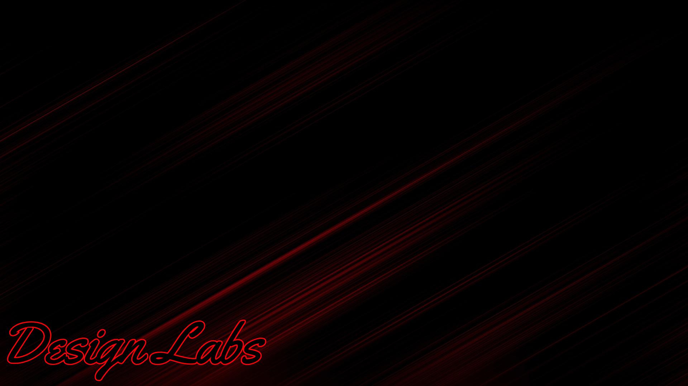

[](https://github.com/CastyiGlitchxz/Design-Labs/actions/workflows/pylint.yml)
[](https://github.com/CastyiGlitchxz/Design-Labs/actions/workflows/eslint.yml)
# How to use Design Labs




 To use Design Labs you first need to open ```terminal for macOS and Linux```, ```Command Prompt or PowerShell for Windows```, on your computer and cd to the location of server.py
 Then run 
```Python3 server.py``` for macOS
 or 
 ```Python server.py``` for Windows and Linux to run the server

 Then go to http://127.0.0.1:8000
 There you go you have Design Labs running

# How to load Labs

 When you first open Design Labs you will see the landing page. Look at the top where the navbar is and click the projects button to go to the projects page. The projects list will be empty by default, to create a project click the ```+``` button and input your project details. Then click the create project button.

 When you have successfully created a project, your project will be added to the projects list, where you can access it when you need to.

## Inside your render file
### By defualt the inside of your render file should like
```html

<main>

</main>

```
You put your main code inside the the ```<main></main>``` tags like the examples above
